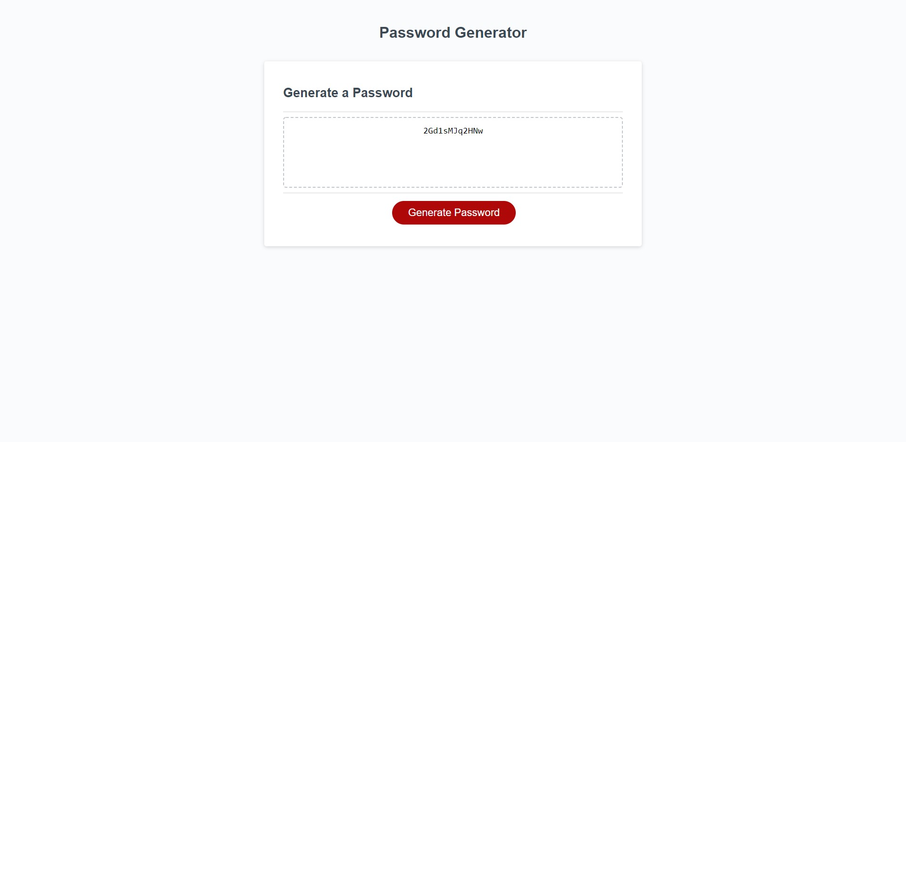

# Damiens-Password_Generator

Website: https://djinksy.github.io/Damiens-Password_Generator/
ScreenShot:

Password Generator is a web application designed to randomize the user a password containing characters between 8-128 long.
The password can contain Uppercase letters, lowercase letters, symbols and numbers, the user has access in chosing what characters they would like in there password.

To create this website, I used HTML, CSS and Javascript syntax, which allowed me to create a basic web design focusing more on the password generator. 
I learnt making this website alot more depth Javascript and the inner code you need to create a simple password generator.